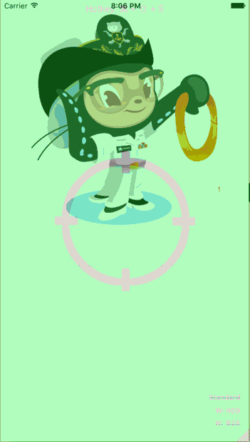

# SAStickyHeader

[](https://travis-ci.org/Shams Ahmed/SAStickyHeader)
[](http://cocoapods.org/pods/SAStickyHeader)
[](http://cocoapods.org/pods/SAStickyHeader)
[](http://cocoapods.org/pods/SAStickyHeader)

## Usage

To run the example project, clone the repo, and run `pod install` from the Example directory first.

## Screenshot

]

## Installation

SAStickyHeader is available through [CocoaPods](http://cocoapods.org). To install
it, simply add the following line to your Podfile:

```ruby
pod "SAStickyHeader"
```

## Instruction

```swift
let images = [UIImage(named: "gracehoppertocat"), UIImage(named: "hipster-partycat")]
        
tableView.tableHeaderView = SAStickyHeaderView(frame: CGRectMake(0, 0, CGRectGetWidth(self.view.frame), 400), table: tableView, image: images)
```
Add `SAStickyHeaderView` in `viewDidLoad` or in `viewForHeaderInSection` tableView delegate method, pass the frame, current table and a array of images.

## Author

Shams Ahmed, shamsahmed@me.com

## License

SAStickyHeader is available under the MIT license. See the LICENSE file for more info.
